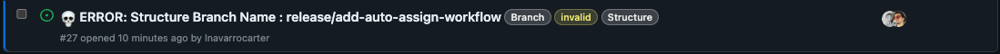
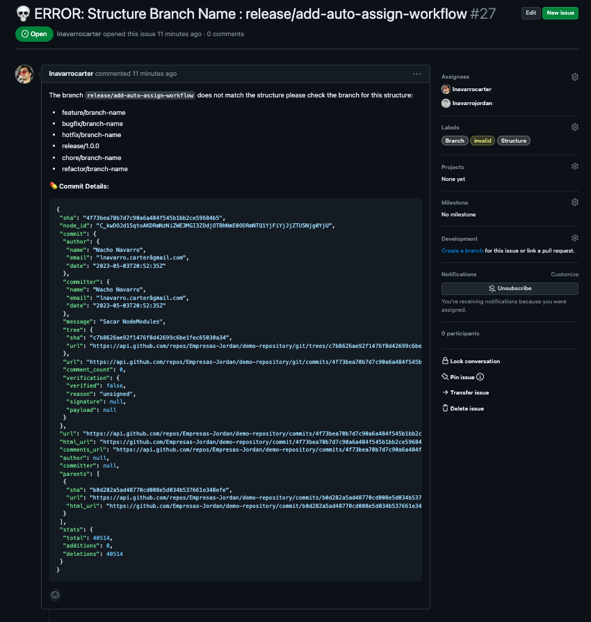

# Rules Engine Repository Actions

## Usage

```yml
name: Actions Rules & Branch Repository
on: 
    push:
        branches:
            - '!main' # exclude main branch
            - '!master' # exclude master branch
            - '**' # matches all branches
jobs:
  test:
    runs-on: ubuntu-latest
    steps:
      - uses: actions/checkout@v2

      - name : Control Rules
        uses: lnavarrocarter/actions-rules-repository@v1.5.0
        with:
          repo: ${{ github.repository }} # Name Repository eg : lnavarrocarter/actions-rules-repository
          github_token: ${{ secrets.GITHUB_TOKEN }} ## Token Github
          assigness : lnavarrocarter # User to Github eg : lnavarrocarter,lnavarrocarter2
          protected_branches : main,develop,release # Branches protected eg : main,develop
          create_branch : true # Create branch if not exist eg : true,false

```

## Inputs

 - `repo`: Nombre del repositorio a verificar las reglas. Ejemplo: lnavarrocarter/actions-rules-repository
 - `github_token`: Token de acceso a Github. Puede ser el token de acceso personal o el token de Github Actions.
 - `assigness`: Usuario de Github al que se le asignara la incidencia en caso de que el branch no cumpla con las reglas. Ejemplo: lnavarrocarter o puedes asignar varios usuarios separados por comas. Ejemplo: lnavarrocarter,lnavarrocarter2
 - `protected_branches`: Branches protegidos que no se pueden eliminar segun las condiciones de la documentacion. Ejemplo: main,develop
 - `create_branch`: Crear branch `develop` | `dev` si no existe y `release/0.0.1` si no existen release activos y las protege. Ejemplo: true,false

# Estrategia de ramas

Esta accion permite el control del repositorio y sus Repositorios, verifica que los branch del repositorio cumplan con las reglas establecidas en el archivo segun la siguiente definicion:

 - `master` o `main`: Es la branch principal que contiene la versión estable y probada del código. Usualmente, esta branch se utiliza como base para los lanzamientos y despliegues.

 - `develop` o `dev`: Es una branch de desarrollo donde se integran las funcionalidades y correcciones de errores antes de fusionarse en la branch principal. Esta branch es común en el modelo Git Flow.

 - `feature/nombre-de-la-funcionalidad`: Estas branches se utilizan para desarrollar nuevas funcionalidades o mejoras en el proyecto. El nombre de la funcionalidad debe ser descriptivo y reflejar el propósito de la branch.

 - `bugfix/nombre-del-error`: Estas branches se utilizan para solucionar errores o problemas en el código. El nombre debe ser descriptivo e indicar el error que se está solucionando.
  
 - `hotfix/nombre-del-error-crítico`: En el modelo Git Flow, las branches de hotfix se crean a partir de la branch principal para solucionar errores críticos en producción. Estas branches se fusionan de nuevo en la branch principal y en la branch de desarrollo una vez solucionado el error.

 - `release/version`: Estas branches se utilizan en el modelo Git Flow para preparar una nueva versión del proyecto antes de fusionarla en la branch principal. La versión puede seguir el esquema de versionado semántico, como release/1.2.0.

 - `chore/nombre-de-la-tarea`: Estas branches se utilizan para tareas de mantenimiento o actualizaciones que no están directamente relacionadas con funcionalidades o correcciones de errores, como la actualización de dependencias o cambios en la configuración del proyecto.

 - `refactor/nombre-de-la-refactorización`: Estas branches se utilizan para realizar cambios en la estructura del código sin modificar su funcionalidad, como mejorar la legibilidad, eliminar redundancias o actualizar patrones de diseño.

Cualquier otro branch generara una incidencia en el repositorio para que el nombre sea cambiado y se asignara al PM o a los desarrolladores en la lista segun la variables assigness

En el caso de que las ramas `main` o `master` no esten protegidas y el los parametros del action tiene la variable `protected_branches` declarada con las ramas separadas por coma protegera automaticamente las ramas.

Eg:
### Issue:
Modeo de issue que se genera en el repositorio.



### Issue Details
Generalmente se asigna a los desarrolladores para que cambien el nombre del branch este tipo de incidencia no se cierra hasta que se cambie el nombre del branch y se volvera a generar en el caso que no se cumpla con el requerimiento.



# Contacto

Este proyecto fue creado por Nacho Navarro. Si tienes alguna pregunta o sugerencia, puedes contactarme en lnavarro.carter@gmail.com.


## Licencia

Este proyecto está bajo la licencia MIT. Consulta el archivo LICENSE para obtener más detalles.